# CrystEngKit: From CIF files to ESP, NCI, and QTAIM plots in a few clicks — a practical suite for supramolecular chemistry and crystal engineering computations.

  

*ESP maps, NCI plots, BCP/bonding paths, and HOMO-LUMO shapes are not only illustrations of your work but also good ideas for journal cover art*.

## Table of Contents

- [Overview](README.md#overview)
- [Installation and Requirements](README.md#installation-and-requirements)
- [Starting the Suite](README.md#starting-the-suite)
- [Tools](README.md#tools)
- [Main Workflows](README.md#main-workflows)
- [Glossary](README.md#glossary)
- [Examples and Benchmark Data](README.md#examples-and-benchmark-data)
- [Troubleshooting](README.md#troubleshooting)
- [Repository contents](README.md#repository-contents)
- [Notes](README.md#notes)

## Overview

CrystEngKit is a practical GUI suite for basic quantum-chemical computations and visualization in supramolecular chemistry and crystal engineering. It helps experimental researchers prepare ORCA/Gaussian input files, run ORCA calculations, monitor results, and turn finished calculations into figures and summary text.

Typical input formats are `.xyz`, existing ORCA `.inp` files, and `.cif` files from single-crystal X-ray diffraction, publications or Cambridge Structural Database (CSD)[^csd].

The suite is built around widely used, freely available academic/freeware programs. ORCA[^orca-site] is used for quantum-chemical calculations, and Multiwfn[^multiwfn-site] is used for wavefunction analysis, ESP/NCI cube generation, and QTAIM critical-point analysis. CrystEngKit does not replace these programs; it provides a practical shell that helps experimental chemists make the first steps into quantum-chemical calculations and convert results into publication-ready images, tables, and text.

CrystEngKit is intended to run on Windows, Linux, and macOS with Python 3.9 or newer. The Orca Input Builder checks for installed Python interpreters on startup and uses the newest suitable Python it finds for companion tools such as ESP, NCI, and QTAIM viewers. ORCA, Multiwfn, and optional external tools must still be installed in versions suitable for your operating system.

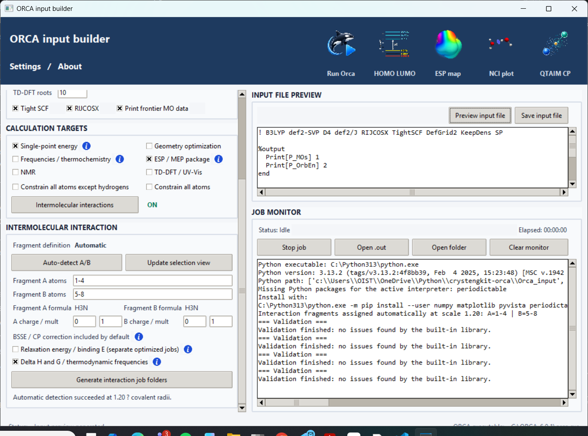

The main GUI is the **ORCA Input Builder**[^orca]. It can:

- read molecular structures from `.cif`, `.xyz`, and ORCA `.inp` files
- prepare ORCA and Gaussian[^gaussian] input files
- run ORCA and show live output
- generate manuscript-ready computation summaries for experimental sections and supporting information
- launch HOMO-LUMO, ESP, NCI, QTAIM, and interaction-energy computations and visualizations.

## Installation and Requirements

For most users, start with the provided installer/checker. It checks the software already present on your computer, offers to add missing Python packages, searches for ORCA and Multiwfn executables, and creates a short installation report.

The installer itself needs Python. If Python is not installed yet, the Windows and Linux/macOS launchers will stop and show where to download or install Python first. After Python 3.9 or newer is installed, run the installer again.

On Windows, run:

```bash
install\install.bat
```

On macOS or Linux, run the matching checker from the `install` folder, or run:

```bash
python install/install.py
```

If the installer reports that ORCA, orca_2aim, or Multiwfn is missing, install the missing program from its official source and then run the checker again. These external chemistry programs may need separate download, license acceptance, or PATH setup. The checker looks in PATH, common installation folders, user folders, and the system disk root using a bounded search; if it finds ORCA or Multiwfn outside PATH, it reports the location so you can use it in Settings.

The full suite uses:

- **Python 3.9+**
- **ORCA**, available free of charge for academic users through the official ORCA/FACCTs pages[^orca-site]
- **orca_2aim**, for generating `.wfn` / `.wfx` files after ORCA runs
- **Multiwfn**, for ESP, NCI, and QTAIM analysis[^multiwfn-site]

The installer does not install ORCA or Multiwfn automatically, because these programs have their own licenses and official download routes. If you prefer manual Python setup, install the main Python packages with:

```bash
pip install numpy pyvista matplotlib periodictable gemmi Pillow
```

`numpy` and `pyvista` are needed for structure preview and 3D plotting. `matplotlib` is used by the HOMO-LUMO energy diagram tool. `periodictable` supports the 3D NCI molecular viewer. `gemmi` is recommended for CIF handling. `Pillow` is used by the HOMO-LUMO MO surface workflow for saved images, thumbnails, and contact sheets.

## Starting the Suite

Launch the main ORCA Builder with:

```bash
python tools/Orca_input/orca_input.py
```

Or double-click the `tools/Orca_input/orca_input.py` file.

## Tools

The analysis tools can be opened from the top panel of the Builder after a calculation, or launched directly.

### ORCA Input Builder

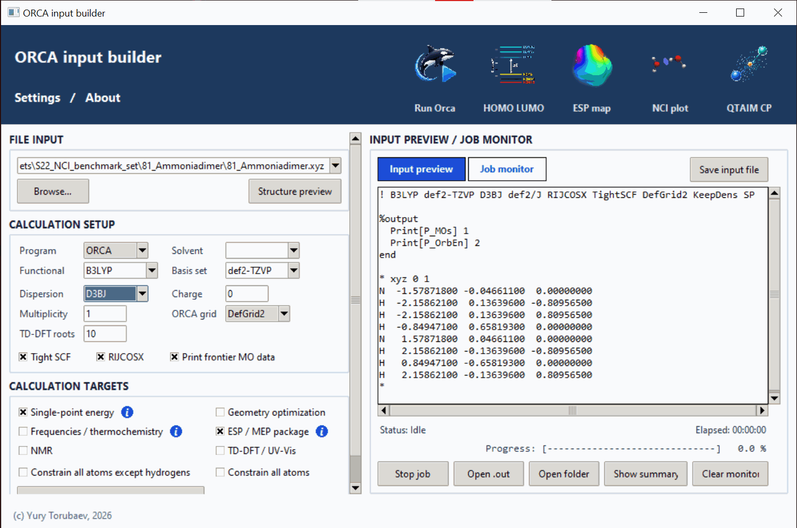The main working window. Use it to prepare ORCA input files from `.cif`, `.xyz`, or existing `.inp` files, run ORCA, monitor the output, generate computation summaries, and prepare dimer intermolecular-interaction jobs.

### HOMO-LUMO Plotter

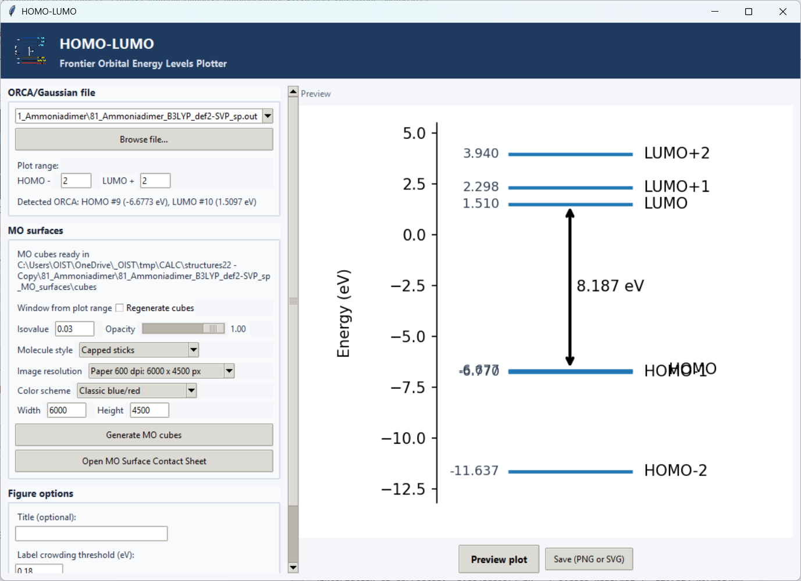Creates frontier-orbital energy diagrams[^frontier-orbitals] from ORCA/Gaussian output or pasted orbital energies. For finished ORCA jobs, it can also generate MO cube files with `orca_plot`, render HOMO/LUMO surface images, and collect saved orbital views into a table.

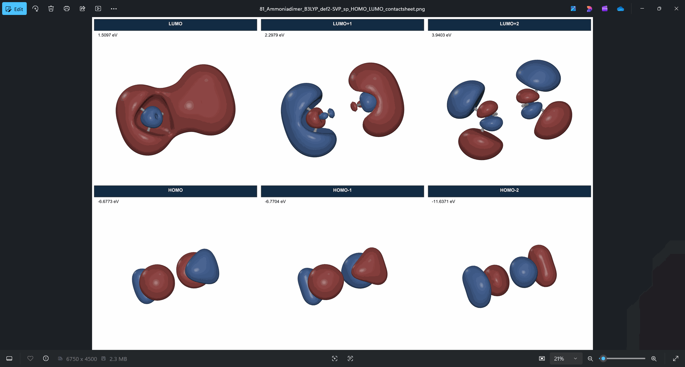

Recent MO-surface tools include capped-sticks molecule rendering by default, optional colored wireframe or ball-and-stick molecule overlays. In the table, each saved MO tile can be reopened with its saved camera, style, and scale. The `Use view for all` button applies the selected tile's saved orientation and zoom/scale to every MO surface in the current table.

### ESP / VisMap

Creates electrostatic-potential maps on electron-density surfaces[^esp]. 
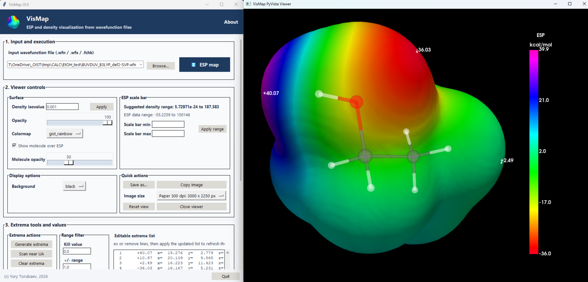
This version is based on the original VisMap code by aaan1s (<https://github.com/aaan1s/VisMap>) and adapts it for this suite with a GUI for ESP data generation and plotting, extrema plotting, and PyVista visualization instead of Mayavi. It uses wavefunction files such as `.wfn`, `.wfx`, or `.fchk`.

### NCI Plotter

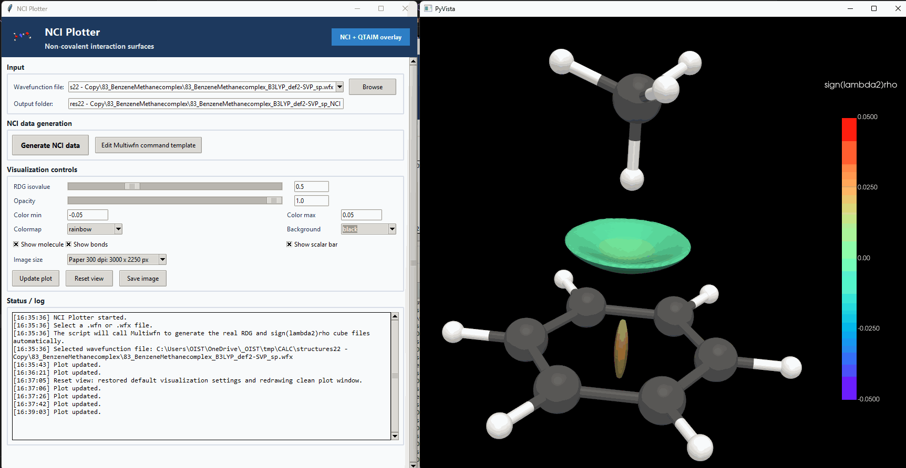

Creates noncovalent-interaction surfaces[^nci] from `.wfn` or `.wfx` files. It is useful for visualizing weak contacts, attractive regions, and repulsive regions in molecular associates, and it can open the NCI + QTAIM overlay viewer when matching topology files are available.

### QTAIM Critical Points Viewer

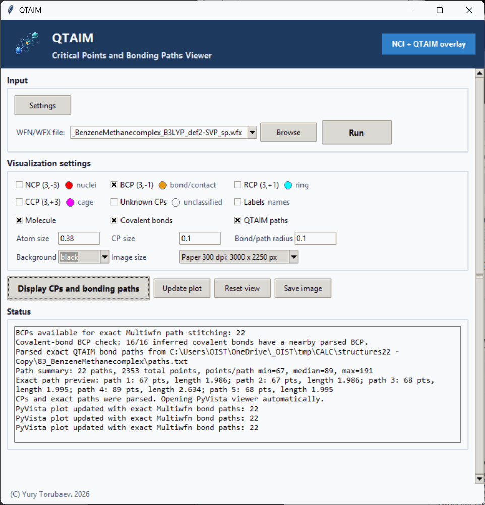

Shows QTAIM bond, ring, and cage critical points[^qtaim] from `.wfn` or `.wfx` files and Multiwfn QTAIM output. The color swatches in the visualization settings are clickable and can be used to change CP and QTAIM bond-path colors.

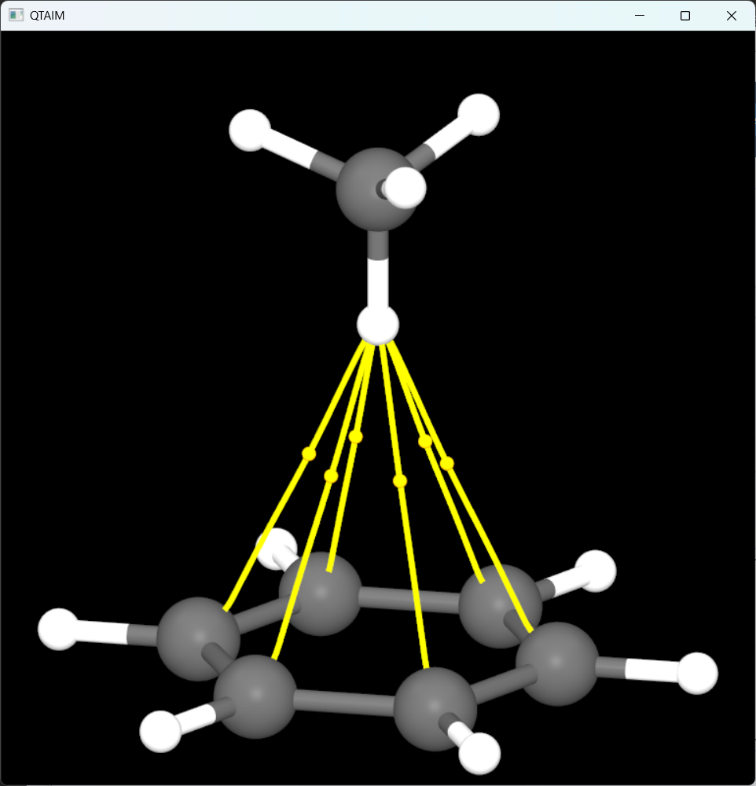

### NCI + QTAIM Overlay

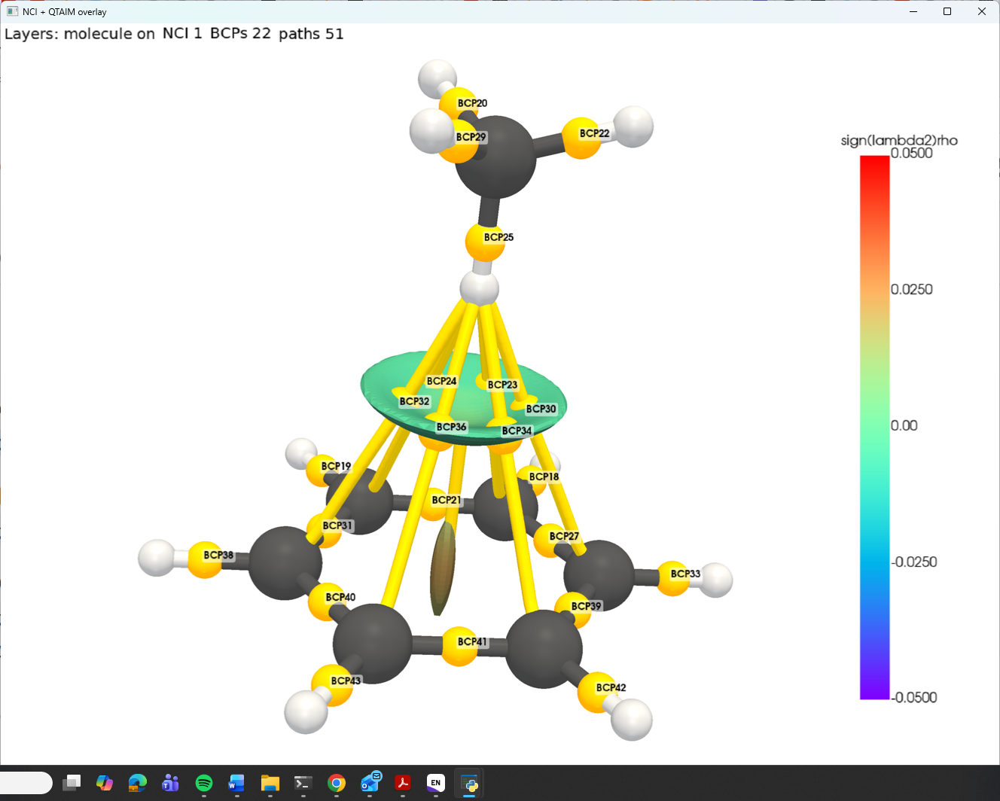

Combines the molecular structure, NCI surface, QTAIM bond critical points, and bond paths in one PyVista view. Use it when the NCI and QTAIM output files have already been generated for the same structure.

## Main Workflows

### Build and Run an ORCA Job

1. Load a `.cif`, `.xyz`, or ORCA `.inp` file in the Builder.
   
   

2. Check the geometry with `Structure preview` if needed.
   
   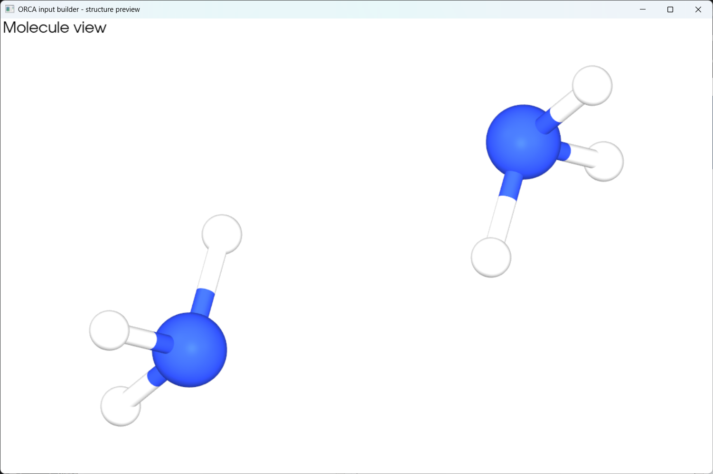

3. Choose the calculation setup: functional, basis set, dispersion correction, solvent (or gas phase if no solvent is chosen or entered), charge, and multiplicity.

4. Choose the target calculation, such as single-point energy, optimization, frequencies, ESP package, TD-DFT, NMR, or dimer interaction energy.

5. Preview and save the `.inp` file.

6. Click `Run Orca` and follow the job in `JOB MONITOR`.

### Make Figures After a Calculation

Use the top-panel buttons after the ORCA job finishes:

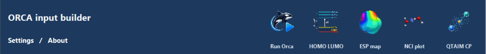

- `HOMO LUMO` for orbital energy diagrams and, from ORCA `.out` / `.gbw` pairs, MO surface images and contact sheets
- `ESP map` for electrostatic-potential surfaces
- `NCI plot` for RDG / sign(lambda2)rho noncovalent-interaction surfaces
- `QTAIM CP` for critical-point inspection

ESP, NCI, and QTAIM workflows require real wavefunction files such as `.wfn` or `.wfx`. In CrystEngKit they are generated automatically by default after the ORCA job finishes.

MO surface rendering requires a finished ORCA `.out` file, its matching `.gbw` file, and `orca_plot` from the ORCA installation.

For consistent MO surface figures, orient and zoom one saved contact-sheet tile, press `S` in the MO viewer to save it, then use `Use view for all` from that tile to regenerate the rest of the current contact sheet with the same view and scale.

### Dimer Interaction Energy

1. Load a dimer structure file.

2. Enable `Intermolecular interaction energy (dimer)` by checking the respective checkbox.

3. Assign fragments automatically or manually.

4. Use the viewer to check the fragment assignment.
   
   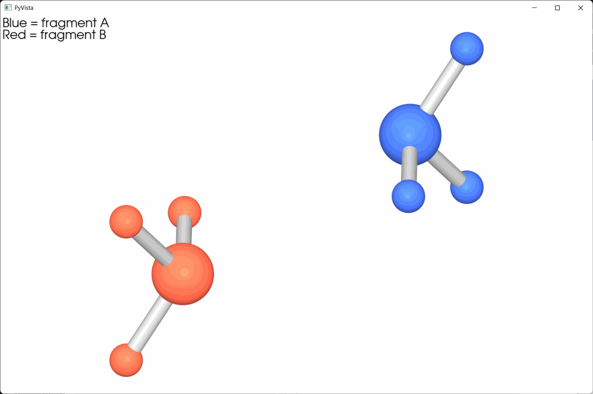

5. Choose whether to include relaxed binding analysis and thermodynamic terms.

6. Run ORCA and review the final summary for the calculated energies (uncorrected, BSSE, and CP-corrected) and the experimental section.
   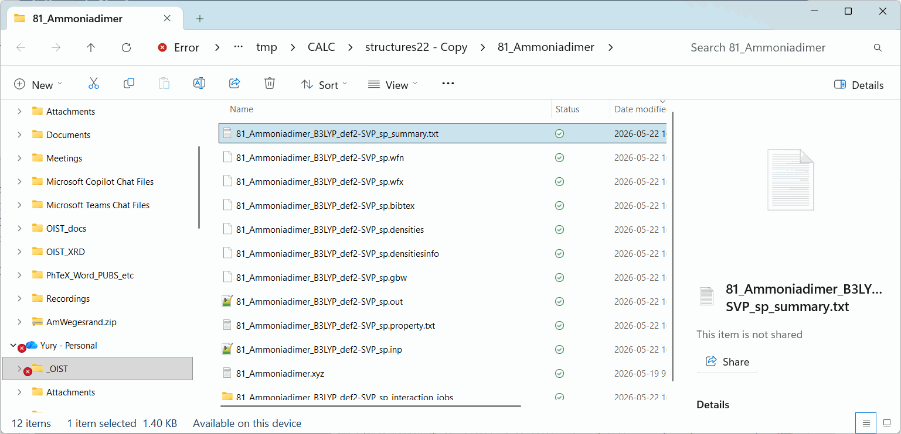
   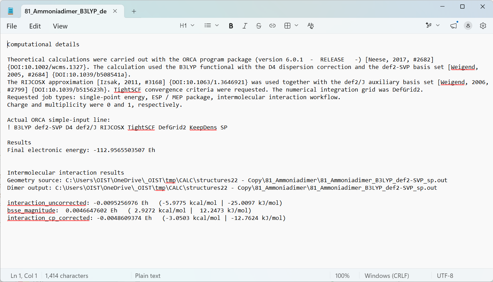

As a workflow sanity check, BSSE counterpoise-corrected intermolecular energies produced by the Builder for S22 examples at B3LYP/def2-SVP showed good agreement with the S22 reference values. The good agreement with the S22 reference values supports the consistency of the computational script logic of CrystEngKit ORCA Input Builder, rather than serving as a direct comparison to the higher-level S22 benchmark methodology. The BEGDB S22 reference values are based on MP2/CBS extrapolation from cc-pVTZ to cc-pVQZ plus a CCSD(T) correction in a modified cc-pVTZ basis set: http://www.begdb.org/index.php?action=oneDataset&id=4&state=show&order=ASC&by=name_m&method=

### Modeling of Solvation Effects

The `Solvent` field adds an implicit-solvent model. For ORCA, the Builder uses the SMD model[^smd] through the `%cpcm` block[^pcm]. Choose a solvent from the dropdown menu, or use `Other solvent...` for a custom ORCA-recognized solvent name.

## Glossary

This short glossary explains the quantum-chemistry terms that appear in the Builder. It is not meant to replace a textbook; it is a quick practical guide to what the options mean before you click `Run Orca`.

### Main Calculation Types

**Single-point energy**  
A calculation of the energy and electronic structure at one fixed geometry. The atoms do not move. Use it when you trust the geometry and want the energy or properties at that structure. FACCTs: [Basic calculation settings](https://www.faccts.de/docs/orca/6.1/manual/contents/essentialelements/basics.html).

**Geometry optimization**  
A calculation that moves the atoms to find a nearby low-energy structure. In practical terms, ORCA changes the geometry step by step until the forces become small. Wiki: [Energy minimization](https://en.wikipedia.org/wiki/Energy_minimization). FACCTs: [Geometry optimizations](https://www.faccts.de/docs/orca/6.1/manual/contents/structurereactivity/optimizations.html).

**Frequencies / thermochemistry**  
A vibrational-frequency calculation. It is used to check whether an optimized structure is a minimum and to estimate thermochemical quantities such as enthalpy and Gibbs free energy. Wiki: [Molecular vibration](https://en.wikipedia.org/wiki/Molecular_vibration). FACCTs: [Vibrational frequencies](https://www.faccts.de/docs/orca/6.1/manual/contents/structurereactivity/frequencies.html).

**TD-DFT / UV-Vis**  
Time-dependent DFT is commonly used to estimate electronic excitations and UV-Vis absorption bands. Wiki: [Time-dependent density functional theory](https://en.wikipedia.org/wiki/Time-dependent_density_functional_theory). FACCTs: [Excited states via RPA, CIS, TD-DFT and SF-TDA](https://www.faccts.de/docs/orca/6.1/manual/contents/spectroscopyproperties/tddft.html).

**NMR calculation**  
A calculation of NMR-related properties such as nuclear shielding, which can be converted or compared with chemical shifts. Wiki: [Nuclear magnetic resonance spectroscopy](https://en.wikipedia.org/wiki/Nuclear_magnetic_resonance_spectroscopy). FACCTs: [Nuclear Magnetic Resonance parameters](https://www.faccts.de/docs/orca/6.1/manual/contents/spectroscopyproperties/nmr.html).

### Method Setup

**DFT**  
Density functional theory is a widely used quantum-chemistry approach where the electron density is the central quantity. Wiki: [Density functional theory](https://en.wikipedia.org/wiki/Density_functional_theory). FACCTs: [Density Functional Theory](https://www.faccts.de/docs/orca/6.1/manual/contents/modelchemistries/DensityFunctionalTheory.html).

**Functional**  
The chosen DFT approximation, such as B3LYP, PBE0, or wB97X-D. The functional strongly affects energies, geometries, noncovalent interactions, and predicted properties. Wiki: [Density functional theory](https://en.wikipedia.org/wiki/Density_functional_theory). FACCTs: [Density Functional Theory](https://www.faccts.de/docs/orca/6.1/manual/contents/modelchemistries/DensityFunctionalTheory.html).

**Basis set**  
The mathematical functions used to describe molecular orbitals. Larger basis sets usually give better accuracy but take more time. Wiki: [Basis set in quantum chemistry](https://en.wikipedia.org/wiki/Basis_set_(chemistry)). FACCTs: [Basis sets](https://www.faccts.de/docs/orca/6.1/manual/contents/essentialelements/basisset.html).

**Dispersion correction**  
An added correction for London dispersion interactions, which are important for crystal packing, pi-stacking, halogen bonding, and many weak contacts. Wiki: [London dispersion force](https://en.wikipedia.org/wiki/London_dispersion_force). FACCTs: [Dispersion corrections](https://www.faccts.de/docs/orca/6.1/manual/contents/modelchemistries/dispersioncorrections.html).

**Charge**  
The total charge of the molecule or molecular assembly. A neutral molecule usually has charge `0`; a cation might be `+1`; an anion might be `-1`. Wiki: [Electric charge](https://en.wikipedia.org/wiki/Electric_charge). FACCTs: [Input of coordinates](https://www.faccts.de/docs/orca/6.1/manual/contents/essentialelements/coordinates.html).

**Multiplicity**  
The spin state of the system. Closed-shell organic molecules are usually singlets with multiplicity `1`. Radicals and metal complexes may require other values. Wiki: [Multiplicity in quantum chemistry](https://en.wikipedia.org/wiki/Multiplicity_(chemistry)). FACCTs: [Input of coordinates](https://www.faccts.de/docs/orca/6.1/manual/contents/essentialelements/coordinates.html).

**SCF**  
Self-consistent field procedure. This is the iterative process used to solve the electronic structure. If SCF does not converge, the calculation cannot reliably finish. Wiki: [Self-consistent field](https://en.wikipedia.org/wiki/Self-consistent_field). FACCTs: [Self-Consistent-Field](https://www.faccts.de/docs/orca/6.1/manual/contents/essentialelements/scf.html).

**Tight SCF**  
A stricter SCF convergence setting. It asks ORCA to converge the electronic structure more carefully, which is often useful for cleaner final energies and post-processing. FACCTs: [SCF convergence settings](https://www.faccts.de/docs/orca/6.1/manual/contents/essentialelements/scf.html).

**ORCA grid**  
The numerical integration grid used in DFT calculations. A finer grid can improve accuracy and stability, but it increases calculation time. FACCTs: [Numerical integration grids](https://www.faccts.de/docs/orca/6.1/manual/contents/essentialelements/numericalintegration.html).

**RIJCOSX**  
An ORCA approximation that can speed up hybrid DFT calculations. For many routine calculations, it gives a useful speed improvement with very small practical loss of accuracy. FACCTs: [Resolution-of-the-Identity](https://www.faccts.de/docs/orca/6.1/manual/contents/essentialelements/RI.html).

### Solvent and Environment

**Implicit solvent**  
A calculation where the solvent is represented as a continuous medium instead of explicit solvent molecules. This is useful when you want approximate solution effects without building many solvent molecules. Wiki: [Implicit solvation](https://en.wikipedia.org/wiki/Implicit_solvation). FACCTs: [Implicit solvation](https://www.faccts.de/docs/orca/6.1/manual/contents/essentialelements/solvationmodels.html).

**CPCM / PCM**  
A common family of continuum solvent models. In ORCA, CPCM settings are often used as part of the solvent setup. Wiki: [Polarizable continuum model](https://en.wikipedia.org/wiki/Polarizable_continuum_model). FACCTs: [Implicit solvation](https://www.faccts.de/docs/orca/6.1/manual/contents/essentialelements/solvationmodels.html).

**SMD**  
A solvation model commonly used for solution-phase DFT calculations. In the Builder, selecting a solvent for ORCA uses the SMD route through the `%cpcm` block when appropriate. Wiki: [Solvent model](https://en.wikipedia.org/wiki/Solvent_model). FACCTs: [The SMD solvation model](https://www.faccts.de/docs/orca/6.1/manual/contents/essentialelements/solvationmodels.html).

### Orbitals and Plots

**HOMO**  
Highest occupied molecular orbital. It is the highest-energy orbital that contains electrons. Wiki: [HOMO/LUMO](https://en.wikipedia.org/wiki/HOMO_and_LUMO). FACCTs: [Orbital and density plots](https://www.faccts.de/docs/orca/6.1/manual/contents/utilitiesvisualization/plots.html).

**LUMO**  
Lowest unoccupied molecular orbital. It is the lowest-energy orbital that is empty in the ground-state electron configuration. Wiki: [HOMO/LUMO](https://en.wikipedia.org/wiki/HOMO_and_LUMO). FACCTs: [Orbital and density plots](https://www.faccts.de/docs/orca/6.1/manual/contents/utilitiesvisualization/plots.html).

**HOMO-LUMO gap**  
The energy difference between the HOMO and LUMO. It is often used as a rough descriptor of electronic softness, reactivity, or optical/electronic behavior, but it should not be overinterpreted alone. Wiki: [HOMO/LUMO](https://en.wikipedia.org/wiki/HOMO_and_LUMO). FACCTs: [Orbital and density plots](https://www.faccts.de/docs/orca/6.1/manual/contents/utilitiesvisualization/plots.html).

**ESP / MEP**  
Electrostatic potential, also called molecular electrostatic potential. It helps visualize electron-rich and electron-poor regions on a molecular surface. This is useful for discussing hydrogen bonding, halogen bonding, electrophilic/nucleophilic regions, and molecular recognition. Wiki: [Electric potential](https://en.wikipedia.org/wiki/Electric_potential). FACCTs: [Electrostatic potentials](https://www.faccts.de/docs/orca/6.1/tutorials/prop/esp.html).

**Electron-density surface**  
A molecular surface defined by a chosen electron-density value. Wiki: [Electron density](https://en.wikipedia.org/wiki/Electron_density). FACCTs: [Orbital and density plots](https://www.faccts.de/docs/orca/6.1/manual/contents/utilitiesvisualization/plots.html).

**Extrema plotting**  
Marking local minima and maxima of the electrostatic potential. These points can help identify likely attractive or repulsive regions around a molecule.

### NCI Analysis

**NCI**  
Noncovalent interaction analysis. It helps visualize weak interactions such as hydrogen bonds, halogen bonds, pi-stacking, dispersion contacts, and steric repulsion. Wiki: [Non-covalent interactions index](https://en.wikipedia.org/wiki/Non-covalent_interactions_index).

**RDG**  
Reduced density gradient. In NCI plotting, an RDG isosurface is colored by a density-related quantity to show attractive, weak, and repulsive regions. Wiki: [Non-covalent interactions index](https://en.wikipedia.org/wiki/Non-covalent_interactions_index).

**sign(lambda2)rho**  
A common NCI coloring quantity. Negative values are usually associated with attractive interactions, values near zero with weak van der Waals contacts, and positive values with steric repulsion. Interpret the colors together with the structure and chemical context. Wiki: [Non-covalent interactions index](https://en.wikipedia.org/wiki/Non-covalent_interactions_index).

### QTAIM Analysis

**QTAIM**  
Quantum Theory of Atoms in Molecules. It analyzes the topology of the electron density and is often used to discuss bonding, bond paths, and critical points. Wiki: [Atoms in molecules](https://en.wikipedia.org/wiki/Atoms_in_molecules). FACCTs: [Utility programs](https://www.faccts.de/docs/orca/6.1/manual/contents/utilitiesvisualization/index_utilitiesvisualization.html).

**Critical point**  
A point in the electron density where the gradient is zero. Different kinds of critical points correspond to nuclei, bonds, rings, or cages. Wiki: [Atoms in molecules](https://en.wikipedia.org/wiki/Atoms_in_molecules).

**BCP**  
Bond critical point. In QTAIM, a BCP is often discussed in connection with a bond path between atoms. Its presence should be interpreted chemically, not treated as automatic proof of a conventional bond. Wiki: [Atoms in molecules](https://en.wikipedia.org/wiki/Atoms_in_molecules).

**RCP and CCP**  
Ring critical point and cage critical point. These appear in ring-like or cage-like topological features of the electron density. Wiki: [Atoms in molecules](https://en.wikipedia.org/wiki/Atoms_in_molecules).

**Bond path**  
A path through the electron density connecting atoms through a bond critical point. Bond paths are useful for visual discussion of QTAIM results. Wiki: [Atoms in molecules](https://en.wikipedia.org/wiki/Atoms_in_molecules).

### Dimer and Interaction-Energy Terms

**Dimer**  
A pair of molecules or molecular fragments treated together in one calculation. In crystal-engineering work, this is often used to study a contact or molecular pair from a crystal structure. Wiki: [Dimer](https://en.wikipedia.org/wiki/Dimer_(chemistry)). FACCTs: [Counterpoise corrections](https://www.faccts.de/docs/orca/6.1/manual/contents/essentialelements/counterpoise.html).

**Fragment A / Fragment B**  
The two parts of a dimer. Correct fragment assignment matters because interaction energies and counterpoise correction depend on which atoms belong to each fragment. FACCTs: [Fragment specification](https://www.faccts.de/docs/orca/6.1/manual/contents/essentialelements/fragmentation.html).

**Interaction energy**  
The energy difference between the dimer and the separated fragments, usually computed to estimate how strongly two fragments interact. Wiki: [Interaction energy](https://en.wikipedia.org/wiki/Interaction_energy). FACCTs: [Counterpoise corrections](https://www.faccts.de/docs/orca/6.1/manual/contents/essentialelements/counterpoise.html).

**Binding energy**  
Often used similarly to interaction energy, but the exact meaning depends on whether geometry relaxation, thermal terms, and basis-set corrections are included. Always check what definition is being used. Wiki: [Binding energy](https://en.wikipedia.org/wiki/Binding_energy).

**BSSE**  
Basis-set superposition error. It occurs when fragments in a dimer artificially benefit from each other's basis functions, making the interaction look too strong. Wiki: [Basis set superposition error](https://en.wikipedia.org/wiki/Basis_set_superposition_error). FACCTs: [Counterpoise corrections](https://www.faccts.de/docs/orca/6.1/manual/contents/essentialelements/counterpoise.html).

**Counterpoise correction**  
A correction used to estimate and reduce BSSE in interaction-energy calculations. Wiki: [Basis set superposition error](https://en.wikipedia.org/wiki/Basis_set_superposition_error). FACCTs: [Counterpoise corrections](https://www.faccts.de/docs/orca/6.1/manual/contents/essentialelements/counterpoise.html).

**Ghost atoms / ghost basis**  
Basis functions placed on atoms that are not actually present as nuclei/electrons in a fragment calculation. They are used in counterpoise correction. FACCTs: [Counterpoise corrections](https://www.faccts.de/docs/orca/6.1/manual/contents/essentialelements/counterpoise.html).

**Relaxation energy**  
The energy change associated with allowing a fragment or complex to relax from one geometry to another. It helps distinguish frozen-geometry interaction from geometry-relaxed binding.

**Delta H and Delta G**  
Changes in enthalpy and Gibbs free energy. These require thermochemical information from frequency calculations and are more expensive than a simple electronic interaction energy. Wiki: [Enthalpy](https://en.wikipedia.org/wiki/Enthalpy) and [Gibbs free energy](https://en.wikipedia.org/wiki/Gibbs_free_energy). FACCTs: [Vibrational frequencies](https://www.faccts.de/docs/orca/6.1/manual/contents/structurereactivity/frequencies.html).

## Examples and Benchmark Data

The `benchmark_sets/S22_NCI_benchmark_set/` folder contains the S22 benchmark structures for training, testing, and evaluation of CrystEngKit calculations. The S22 data are provided as reference examples, not as newly generated CrystEngKit results. The `examples/` folder is currently left empty and reserved for future examples.

When using S22 or other BEGDB-derived benchmark data, cite both the original paper(s) attached to the respective BEGDB record and the BEGDB database paper itself[^begdb].

## Troubleshooting

### ORCA does not start

Check:

- `Settings` -> ORCA executable path
- whether `orca` / `orca.exe` exists and is accessible

### HOMO-LUMO button does not work

Check:

- that a valid ORCA output exists
- that the HOMO-LUMO script path in `Settings` is correct

For MO surface images, also check:

- that the matching `.gbw` file is next to the ORCA `.out` file
- that `orca_plot` is available from the ORCA installation
- that `numpy`, `pyvista`, and `Pillow` are installed

### ESP map does not work

Check:

- that the ORCA run produced a usable `.wfn`, `.wfx`, or `.fchk` file
- that `orca_2aim` and Multiwfn are available
- that the ESP script path and Python command are correct

### NCI plot does not work

Check:

- that the ORCA run produced a usable `.wfn` or `.wfx` file
- that Multiwfn is available and selected in the NCI Plotter
- that the NCI Plotter script path and Python command are correct
- that the Multiwfn command template matches your installed Multiwfn version

### QTAIM CP does not work

Check:

- that the ORCA run produced a usable `.wfn` or `.wfx` file
- that Multiwfn is available and selected in the QTAIM Critical Points Viewer
- that the QTAIM CP script path and Python 3.9+ command are correct in `Settings`
- that Multiwfn is able to complete the QTAIM critical-point search for your structure
- that the selected file is from a completed calculation, not a failed or unfinished job

### Structure preview does not open

Check:

- `numpy`
- `pyvista`
- `matplotlib`
- `periodictable`

### Interaction workflow finishes partially

This can happen when:

- frozen interaction jobs succeed
- but a later relaxed or thermodynamic follow-up job fails

In that case, the summary should still preserve the successful interaction terms and report a crash note.

## Repository contents

Typical root structure:

```text
README.md
LICENSE
docs/
images/                         # README/wiki screenshots and figures
install/
examples/                       # reserved for future examples
benchmark_sets/
  S22_NCI_benchmark_set/
tools/
  images/                       # shared tool icons
  Orca_input/
  HOMO_LUMO/
  VisMap_5.0/
  NCI_plot/
  NCI_QTAIM_overlay/
  qtaim-cp/
  shared/
```

## References

[^csd]: C. R. Groom, I. J. Bruno, M. P. Lightfoot and S. C. Ward, *The Cambridge Structural Database*, Acta Cryst. B, 2016, 72, 171–179. DOI: [10.1107/S2052520616003954](https://doi.org/10.1107/S2052520616003954)

[^orca]: Neese, F.; Wennmohs, F.; Becker, U.; Riplinger, C. The ORCA quantum chemistry program package. *J. Chem. Phys.* **2020**, *152*, 224108. https://doi.org/10.1063/5.0004608; Neese, F. Software Update: The ORCA Program System—Version 6.0. *WIREs Comput. Mol. Sci.* **2025**, *15*, e70019. https://doi.org/10.1002/wcms.70019

[^orca-site]: Official ORCA / FACCTs site: https://www.faccts.de/orca/ ; ORCA forum and downloads: https://orcaforum.kofo.mpg.de/

[^gaussian]: Frisch, M. J.; Trucks, G. W.; Schlegel, H. B.; Scuseria, G. E.; Robb, M. A.; Cheeseman, J. R.; Scalmani, G.; Barone, V.; Petersson, G. A.; Nakatsuji, H.; et al. *Gaussian 16*, Revision C.01; Gaussian, Inc.: Wallingford, CT, 2016. https://gaussian.com/citation/

[^multiwfn]: Lu, T.; Chen, F. Multiwfn: A multifunctional wavefunction analyzer. *J. Comput. Chem.* **2012**, *33*, 580–592. https://doi.org/10.1002/jcc.22885

[^multiwfn-site]: Official Multiwfn site: http://sobereva.com/multiwfn

[^esp]: Politzer, P.; Murray, J. S. The fundamental nature and role of the electrostatic potential in atoms and molecules. *Theor. Chem. Acc.* **2002**, *108*, 134–142. https://doi.org/10.1007/s00214-002-0363-9; Murray, J. S.; Politzer, P. The electrostatic potential: an overview. *WIREs Comput. Mol. Sci.* **2011**, *1*, 153–163. https://doi.org/10.1002/wcms.19

[^frontier-orbitals]: Fukui, K. Role of frontier orbitals in chemical reactions. *Science* **1982**, *218*, 747–754. https://doi.org/10.1126/science.218.4574.747

[^nci]: Johnson, E. R.; Keinan, S.; Mori-Sánchez, P.; Contreras-García, J.; Cohen, A. J.; Yang, W. Revealing noncovalent interactions. *J. Am. Chem. Soc.* **2010**, *132*, 6498–6506. https://doi.org/10.1021/ja100936w; Contreras-García, J.; Johnson, E. R.; Keinan, S.; Chaudret, R.; Piquemal, J.-P.; Beratan, D. N.; Yang, W. NCIPLOT: A program for plotting noncovalent interaction regions. *J. Chem. Theory Comput.* **2011**, *7*, 625–632. https://doi.org/10.1021/ct100641a

[^qtaim]: Bader, R. F. W. A quantum theory of molecular structure and its applications. *Chem. Rev.* **1991**, *91*, 893–928. https://doi.org/10.1021/cr00005a013; Bader, R. F. W. *Atoms in Molecules: A Quantum Theory*; Oxford University Press: Oxford, 1990.

[^pcm]: Cossi, M.; Rega, N.; Scalmani, G.; Barone, V. Energies, structures, and electronic properties of molecules in solution with the C-PCM solvation model. *J. Comput. Chem.* **2003**, *24*, 669–681. https://doi.org/10.1002/jcc.10189; Tomasi, J.; Mennucci, B.; Cammi, R. Quantum mechanical continuum solvation models. *Chem. Rev.* **2005**, *105*, 2999–3093. https://doi.org/10.1021/cr9904009

[^smd]: Marenich, A. V.; Cramer, C. J.; Truhlar, D. G. Universal solvation model based on solute electron density and on a continuum model of the solvent defined by the bulk dielectric constant and atomic surface tensions. *J. Phys. Chem. B* **2009**, *113*, 6378–6396. https://doi.org/10.1021/jp810292n

[^dft]: Hohenberg, P.; Kohn, W. Inhomogeneous electron gas. *Phys. Rev.* **1964**, *136*, B864–B871. https://doi.org/10.1103/PhysRev.136.B864; Kohn, W.; Sham, L. J. Self-consistent equations including exchange and correlation effects. *Phys. Rev.* **1965**, *140*, A1133–A1138. https://doi.org/10.1103/PhysRev.140.A1133

[^basis-sets]: Weigend, F.; Ahlrichs, R. Balanced basis sets of split valence, triple zeta valence and quadruple zeta valence quality for H to Rn: Design and assessment of accuracy. *Phys. Chem. Chem. Phys.* **2005**, *7*, 3297–3305. https://doi.org/10.1039/B508541A

[^dispersion]: Grimme, S.; Antony, J.; Ehrlich, S.; Krieg, H. A consistent and accurate ab initio parametrization of density functional dispersion correction (DFT-D) for the 94 elements H–Pu. *J. Chem. Phys.* **2010**, *132*, 154104. https://doi.org/10.1063/1.3382344; Grimme, S.; Ehrlich, S.; Goerigk, L. Effect of the damping function in dispersion corrected density functional theory. *J. Comput. Chem.* **2011**, *32*, 1456–1465. https://doi.org/10.1002/jcc.21759; Caldeweyher, E.; Ehlert, S.; Hansen, A.; Neugebauer, H.; Spicher, S.; Bannwarth, C.; Grimme, S. A generally applicable atomic-charge dependent London dispersion correction. *J. Chem. Phys.* **2019**, *150*, 154122. https://doi.org/10.1063/1.5090222

[^orca-runtypes]: Neese, F. *ORCA Manual*, Release 6.1; FACCTs GmbH, 2026. https://www.faccts.de/docs/orca/6.1/manual/

[^tddft]: Runge, E.; Gross, E. K. U. Density-functional theory for time-dependent systems. *Phys. Rev. Lett.* **1984**, *52*, 997–1000. https://doi.org/10.1103/PhysRevLett.52.997

[^scf]: Roothaan, C. C. J. New developments in molecular orbital theory. *Rev. Mod. Phys.* **1951**, *23*, 69–89. https://doi.org/10.1103/RevModPhys.23.69; Roothaan, C. C. J. Self-consistent field theory for open shells of electronic systems. *Rev. Mod. Phys.* **1960**, *32*, 179–185. https://doi.org/10.1103/RevModPhys.32.179

[^rijcosx]: Izsák, R.; Neese, F. An overlap fitted chain of spheres exchange method. *J. Chem. Phys.* **2011**, *135*, 144105. https://doi.org/10.1063/1.3646921; Helmich-Paris, B.; de Souza, B.; Neese, F.; Izsák, R. An improved chain of spheres for exchange algorithm. *J. Chem. Phys.* **2021**, *155*, 104109. https://doi.org/10.1063/5.0058766

[^counterpoise]: Boys, S. F.; Bernardi, F. The calculation of small molecular interactions by the differences of separate total energies. Some procedures with reduced errors. *Mol. Phys.* **1970**, *19*, 553–566. https://doi.org/10.1080/00268977000101561

[^begdb]: Řezáč, J.; Jurečka, P.; Riley, K. E.; Černý, J.; Valdes, H.; Pluháčková, K.; Berka, K.; Řezáč, T.; Pitoňák, M.; Vondrášek, J.; Hobza, P. *Collect. Czech. Chem. Commun.* **2008**, *73*, 1261-1270. http://dx.doi.org/10.1135/cccc20081261 ; http://cccc.uochb.cas.cz/73/10/1261/
